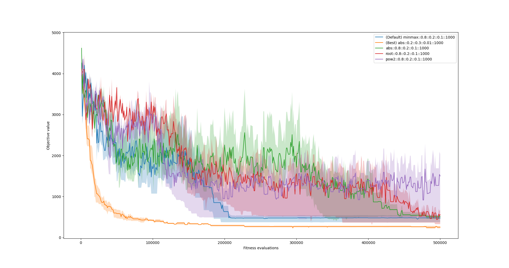

# Assignment 2: Bin Packing using GA

## What fitness functions I implemented
Absolute value (p1 metric)
```
def fitness_abs(ind, weights):
    bw = bin_weights(weights, ind)
    mu = sum(bw) / K
    fitness = 1 / (np.sum(np.abs(np.array(bw) - mu)) + 1)
    return utils.FitObjPair(fitness=fitness, objective=max(bw) - min(bw))
 ```
Euclid distance (p2 metric)
```
def fitness_pow2(ind, weights):
    bw = bin_weights(weights, ind)
    mu = sum(bw) / K
    fitness = 1 / (np.sum(np.pow(np.abs(np.array(bw) - mu, 2))) + 1)
    return utils.FitObjPair(fitness=fitness, objective=max(bw) - min(bw))


```
sqrt distance (p_{1/2} metric)
```
def fitness_root(ind, weights):
    bw = bin_weights(weights, ind)
    mu = sum(bw) / K
    fitness = 1 / (np.sum(np.sqrt(np.abs(np.array(bw) - mu))) + 1)
    return utils.FitObjPair(fitness=fitness, objective=max(bw) - min(bw))
```
## What I tried
* I used grid search to find optimal parameters
* Grid search was performed with following settings:
    * REPEATS = 50
    * MAX_GEN = 500
    * POP_SIZE = 1000
* These were parameters on the grid:


```
# Options
variants = {
    "fitness" : [fitness_minmax, fitness_abs, fitness_root, fitness_pow2],
    "cross_prob": [0.2, 0.5, 0.8],  # crossover prob
    "mut_prob": [0.01, 0.05, 0.1, 0.2, 0.3],  # mutation prob
    "mut_fip_prob": [0.01, 0.05, 0.1, 0.2, 0.3],  # prob of flipping during mutation
    "pop_s": [50000]  # population size
}

# Create grid
varNames = sorted(variants)
experiments = [dict(zip(varNames, prod)) for prod in it.product(*(variants[varName] for varName in varNames))]

# Train
for experiment in experiments:
    ...
    ...
```

## Best Result: 37
* When grid search finished, I used the best found parameters and run GA with greater population
* Settings:
    * REPEATS = 100
    * MAX_GEN = 600
    * POP_SIZE = 50,000
 
* These were the best params found by grid search:
    * fitness = fitness_abs  (p1 metric) 
     * cross_prob = 0.2
     * mut_prob = 0.3
     * mut_fip_prob = 0.01
     * population_size = 10,000
     * generations = 500 (conveged to best value after 329 generations)
     
 * **Best Result**
     * **Objective value (max-min): 37**
     * after 329 generations
     
## Figure
* I include single figure
* It includes few runs from the grid search:
    * default settings
    * best found settings
    * all implemented fitness functions with otherwise default settings
* We can see, that much lover cross probability
    * significantly improves of convergence
    * significantly reduces variance of results
* legend is in the format  fitness::cross_prob::mut_prob::mut_fip_prob::population_size




